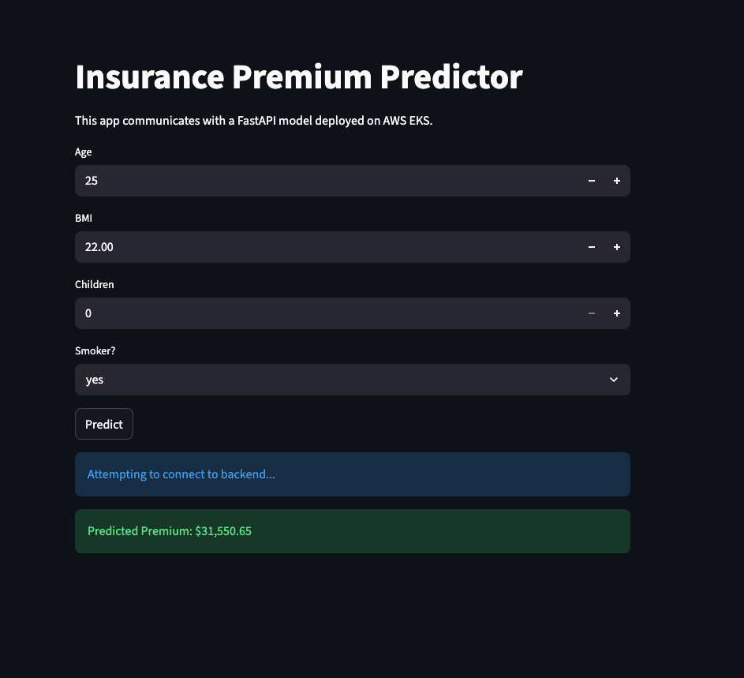
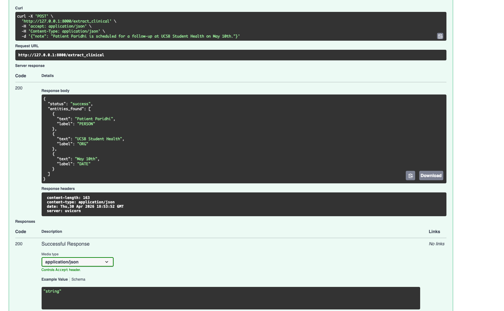

# Medical Insurance & Clinical Intelligence (End-to-End MLOps)

This project demonstrates a full machine learning lifecycle—integrating statistical regression with **Natural Language Processing (NLP)**—deployed on a production-grade AWS Kubernetes (EKS) cluster.

## 🚀 Key Features

- **Multi-Model API:** Single FastAPI gateway for insurance cost prediction and clinical entity extraction.
- **Named Entity Recognition (NER):** Extracts critical data points (Patients, Hospitals, Dates) from unstructured medical notes.
- **Scalable Infrastructure:** Deployed on AWS EKS with Elastic Load Balancing.
- **Containerized:** Dockerized environment including pre-trained neural network models.

## 🛠 Tech Stack

- **Language:** Python 3.12 (MacBook Air Dev Environment)
- **ML & NLP:** Scikit-Learn, Pandas, **spaCy (en_core_web_sm)**
- **Cloud & DevOps:** AWS (ECR, EKS, ELB), Docker, Kubernetes, Jenkins
- **Frameworks:** FastAPI, Pydantic

## 📸 Deployment & NLP Proof

### 1. Insurance Cost Prediction

Verification of the service successfully processing structured data and returning a cost prediction:


### 2. Clinical Entity Extraction (NER)

Proof of the NLP "brain" parsing unstructured clinical notes to identify key entities:



## 🏃 How to Run Locally

1. **Install Dependencies:**
   ```bash
   pip install -r requirements.txt
   python -m spacy download en_core_web_sm
   ```
2. **Start the API (Backend):** - uvicorn src.main:app --reload
3. **Start the UI:** - streamlit run streamlit_app.py
